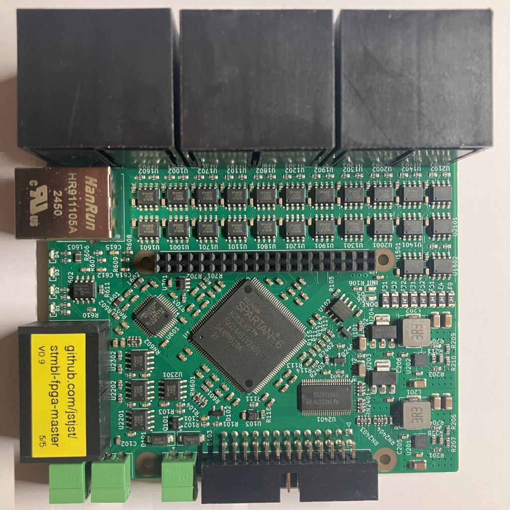
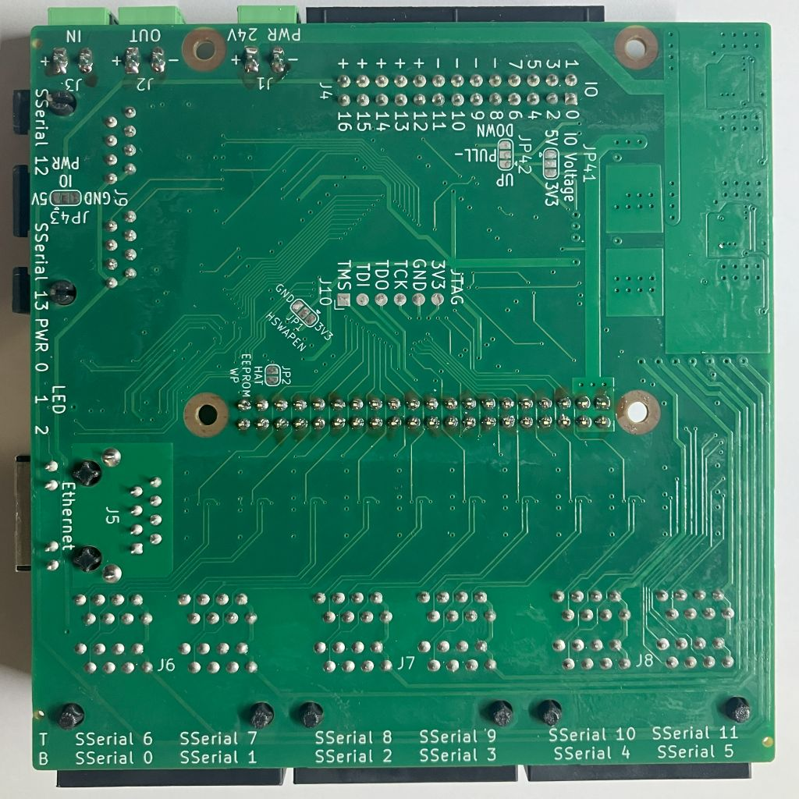

DISCLAIMER
===

THE AUTHORS OF THIS SOFTWARE ACCEPT ABSOLUTELY NO LIABILITY FOR
ANY HARM OR LOSS RESULTING FROM ITS USE.  IT IS _EXTREMELY_ UNWISE
TO RELY ON SOFTWARE ALONE FOR SAFETY.  Any machinery capable of
harming persons must have provisions for completely removing power
from all motors, etc, before persons enter any danger area.  All
machinery must be designed to comply with local and national safety
codes, and the authors of this software can not, and do not, take
any responsibility for such compliance.

This firmware in the folder hostmot2-firmware originates from Mesa Electronics.
This repository  is released under the GPLv3.

STMBL FPGA Master
=====

This is a FPGA controller board specifically designed to be used as a master for up to 12 stmbl drives. It can be used for other applications.
The hardware has the same form factor as the [STMBL](https://github.com/freakontrol/stmbl) v5 drives.
The FPGA runs the hostmot2 firmware.

## Hardware overview
- 12 SSerial ports
- 2 SSerial/RS485 ports
- one 26 Pin parallel expansion port (17 IOs)
- one 24V Input
- one 24V Output
- Host connection via Ethernet or SPI (if used with a RPi 4 or 5)
- 24V Power Input (provides also power to the Raspberry Pi)

  

## Known Bugs

**Please note that the hardware and firmware are in an early prototyping stage.**
Don't manufacture the version 0.9 because of the reversed SSerial pinouts

- affects hardware v0.9: Pinout of SSerial 0-5 and 12-13 is reversed (1-8, 2-7, ...), use a [Rollover cable](https://en.wikipedia.org/wiki/Rollover_cable)
- SSerial 13 ist not working, there seems to be a bug in the PIN file
- At the moment there is no option to enable power to the SSerial ports before loading the hm2 driver. So it is not possible to use SSerial devices that a powered form the SSerial connector. Can be fixed in firmware.

* * * 
If you have questions about this project contact me [here](https://matrix.to/#/@jst:freiburg.social).
